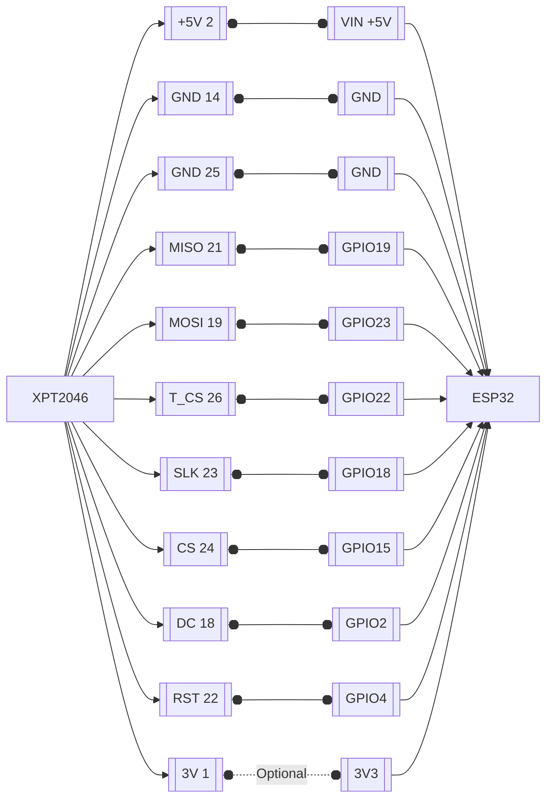
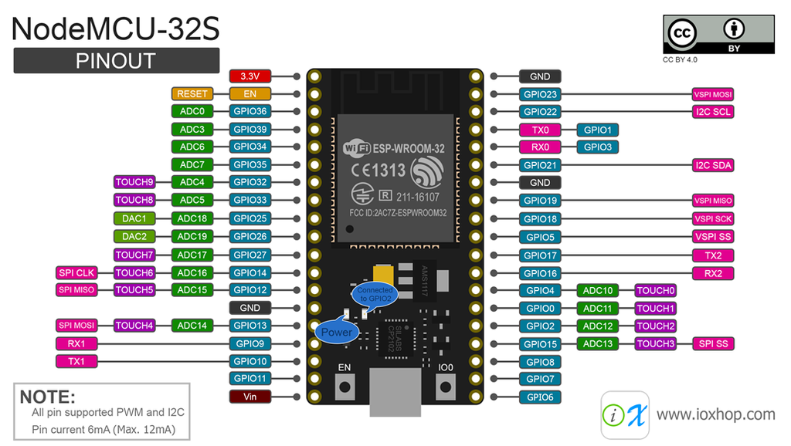
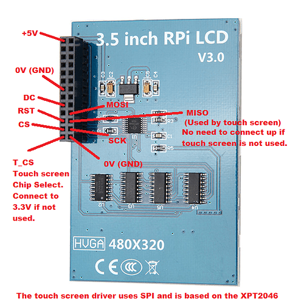

# TFT
ESP32 + RPi  LCD (A) v3 demo XPT2046 base on ILI9486 DRIVER

## Wire connection

# PinOut

## ESP32

## XPT2046

Key Parameters
SKU 	MPI3501
LCD Type 	TFT
LCD Interface 	SPI(Fmax:32MHz)
Touch Screen Type 	Resistive
Touch Screen Controller 	XPT2046
Colors 	65536
Driver IC 	ILI9486
Backlight 	LED
Resolution 	320*480 (Pixel)
Backlight Current 	120ma
Power Dissipation 	0.13A*5V
Operating Temp. (℃) 	-20~60
Active Area 	48.96x73.44(mm)
Product Size 	85.42*55.60(mm)
Package Size 	118*72*34 (mm)
Rough Weight(Package containing) 	75 (g) 

# Sources
## XPT2040

[LCD Wiki](http://www.lcdwiki.com/3.5inch_RPi_Display)
[Another LCD shares](https://www.waveshare.com/wiki/3.5inch_RPi_LCD_(C))
[XPT2046 tough arduino libray](https://github.com/PaulStoffregen/XPT2046_Touchscreen)

## ESP32

[ESP32 pinout](https://www.studiopieters.nl/esp32-pinout/)
[XPT2046 Touch with ESP32](https://www.hackster.io/nash-ali/using-the-ili9341-tft-xpt2046-touch-with-esp32-arduino-ac8eed)
